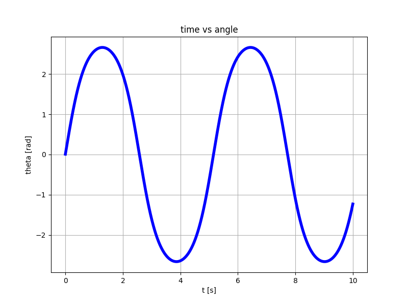

# Control Systems in Python
Learning how to use the Control Systems Python library

## Examples
### Linear system 1
Self explanatory...
```bash
python3 tutorial1.py
```
### Linear system 2
Also self explanatory...
```bash
python3 tutorial2.py
```

### Non-linear pendulum
It has nothing to do with the Python library but I wanted to simulate this stuff anyway.

> NOTE: I cannot find a better implementation online so I made this up and I am not sure this is correct.
However, some things match:
- The angular frequency for small angles
- The energy is conserved when no perturbation is applied

The update equation follows this idea:
- I don't know a closed formula for the angular speed (`theta_dot` or `omega`)
- I create two truncated Taylor expansions for `delta theta` wherein the speed has opposite sign
- I add the two expansions up and I don't need to know `omega` to update theta

```
theta(t + dt) - theta(t) ~ +theta_dot(t) * dt + 1/2 theta_double_dot(t) * dt^2  +
theta(t - dt) - theta(t) ~ -theta_dot(t) * dt + 1/2 theta_double_dot(t) * dt^2  =
--------------------------------------------------------------------------------
theta(t + dt) + theta(t - dt) =~ alpha(t) * dt^2
=>
theta(t + dt) =~ alpha(t) * dt^2 - theta(t - dt)
```

```
python3 non-linear-pendulum.py
```
or
```
python3 non-linear-pendulum-with-perturbations.py
```


With the default values, the output is


> WARNING! Don't stare at the pendulum for too long! :)

# Resources:
- [YouTube Tutorial 1](https://www.youtube.com/watch?v=ZNBAq9dT4IE)
- [YouTube Tutorial 2](https://www.youtube.com/watch?v=qBDcHKkHzIE&t)
- [Library documentation](https://python-control.readthedocs.io/en/0.10.1/)
